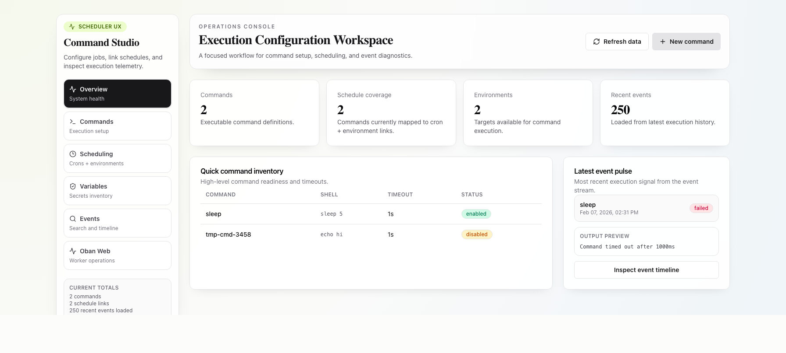
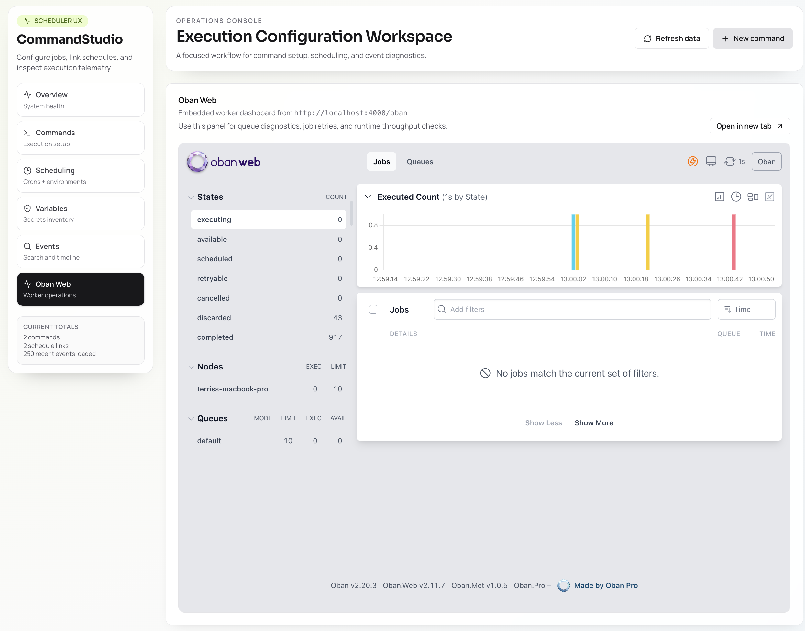

# Command Studio

Configure and monitor the remote execution of shell commands with the abilty to pass secrets to them. Secrets are encrypted at rest.

## Technologies

- [Elixir](https://elixir-lang.org/)
  - [Usage Rules](https://hexdocs.pm/usage_rules)
  - [Phoenix](https://www.phoenixframework.org/)
  - [LiveView](https://hexdocs.pm/phoenix_live_view/) for admin UI
  - [Ash](https://ash-hq.org/): Define your model, derive the rest -- including paginated remote queries and many other table stakes
  - [Ash Postgres](https://hexdocs.pm/ash_postgres/) for persistence
  - [Ash Authentication](https://hexdocs.pm/ash_authentication/)
  - [Oban](https://oban.pro/) for robust job execution
- [ReactJS](https://react.dev/)
  - [TanStack Start](https://tanstack.com/start/)
  - [TanStack Query](https://tanstack.com/query/)
  - [shadcn/ui](https://shadcn-ui.com/) for UI components
  - Embeds [Oban Web](https://getoban.pro/) via an IFrame
  - Communicates with Phoenix/Ash via [Ash TypeScript](https://hexdocs.pm/ash_typescript). As far as the app is concerned, it's TypeScript All the Way Down!

## UX

The React application lets users:

- Define commands (shell scripts) to run with constraints (currently only maximum execution time). Secrets can be emedded in commands by referring to them by name, such as `$secret_name`. Secrets can have one value per environment.
- Define execution environments
- Manage encrypted secrets that can be embedded into commands securely
  - They don't appear, for example, in history files or `ps`
- Schedule commands to run on specified environments using crontab expressions
- Monitor command execution events with filters and pagination
- View additional details via Oban Web




## Installation

### 1. Install Postgres

`brew install postgresql@18`

### 2. Install Elixir

```bash
brew install elixir
```

Verify:

```bash
elixir --version
mix --version
```

### 3. Install nvm

```bash
curl -o- https://raw.githubusercontent.com/nvm-sh/nvm/v0.40.3/install.sh | bash
```

Reload your shell:

```bash
source ~/.nvm/nvm.sh
```

### 4. Clone the repository

```bash
git clone https://github.com/dev-guy/CommandStudio.git
cd CommandStudio
```

### 5. Install NodeJS

```bash
cd webapp/studio
nvm install
nvm use
node -v
```

### 6. Install dependencies

Backend:

```bash
cd phoenix
mix deps.get
```

Frontend:

```bash
cd webapp/studio
npm install
```

### 7. Prepare the database

```bash
cd phoenix
mix setup
```

### 8. Add the admin user

The admin user is `admin@example.com`

```bash
cd phoenix
mix run priv/repo/seeds.exs
```

This command outputs a random password. Take a note of it.

### 9. Run the app

Start Phoenix:

```bash
cd phoenix
mix phx.server
```

Run the React UI:

```bash
cd webapp/studio
npm run dev
```

## Usage

Go to:
- [CommandStudio](http://localhost:5173)
- [Ash Admin](http://localhost:4000/admin)
- [Oban Web](http://localhost:4000/oban)

## The Code

## Ash Highlights

- The model has many to many relationships. These are harder than you might think.
- Contains nontrivial searches with pagination
- The AI assistant added password-based authentication via Ash Authentication plus username/password form + a logout menu in about 10 minutes. The most time I spent was deciding how I wanted the admin account to be seeded.

### AI-Assisted Development

- The following MCP server are recommended:
  - [DevTools MCP](https://github.com/ChromeDevTools/chrome-devtools-mcp)
  - [Tidewave MCP](https://github.com/tidewave-ai/tidewave)
- "boot" your AI Assistant by instructing it to "follow the instructions in [ai/boot.md](ai/boot.md)"

### Ash + Oban Collaboration

The Command resource defines Ash generic actions (action `:enqueue_run`, `:enqueue_run_in`, `:enqueue_run_force`) that call `Jobs.enqueue_command/2`, and that function enqueues the Oban job via `Oban.insert/1`.

See the Mermaid sequence document: [docs/ash-oban-sequence.md](docs/ash-oban-sequence.md)

Why use Oban? Oban is robust and has a fantastic operational UI. It has the following benefits that took years to perfect:

- Durability: jobs are persisted in Postgres, so work survives restarts
- Reliability: retries, backoff, and failure tracking are built in
- Observability: Oban Web provides real-time queue and job introspection
- Control: queue-level tuning and worker isolation keep execution predictable
- It works with Ecto/Postgres

### Creation

The following documents were generated with ChatGPT 5.3 and then fed into Codex:

- [PRD](ai/prd.md)
- [Architecture](ai/architecture.md)
- [Development Plan](ai/devplan.md)

Development did not start until AGENTS.md was generated via [Usage_Rules](https://hexdocs.pm/usage_rules).

#### React Notes

1. TanStack Start was run by Codex. However, manual installation is recommended.
2. I didn't specify using `class-variance-authority`. Models already know about it.
3. `webapp/studio/eslint.config.js` was configured with `globalIgnores(['dist', 'src/lib/ash_rpc.ts'])` so ESLint skips the generated Ash RPC client file. Otherwise, eslint will report many errors.
