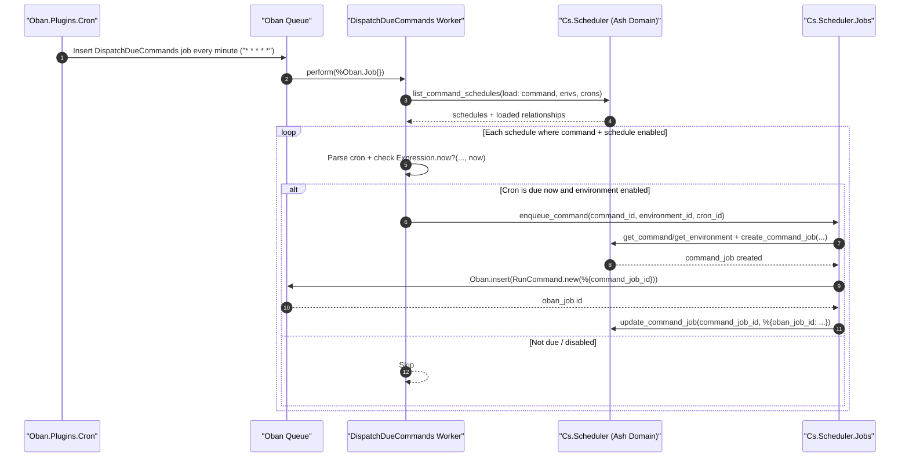
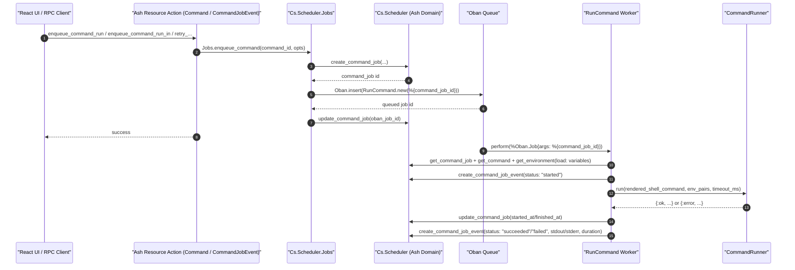

# Ash + Oban Sequence

Ash and Oban coordinate to execute commands.

## 1) Every-minute dispatch loop (Oban -> Ash -> Oban)

## 2) Ash action path (Ash -> Oban queue)

## Where this behavior is configured in code

- Minute wake-up: `config/config.exs` (`Oban.Plugins.Cron`, `"* * * * *"`)
- Dispatch worker: `phoenix/lib/cs/scheduler/workers/dispatch_due_commands.ex`
- Enqueue bridge (Ash -> Oban): `phoenix/lib/cs/scheduler/jobs.ex`
- Ash actions that queue jobs: `phoenix/lib/cs/scheduler/command.ex`, `phoenix/lib/cs/scheduler/command_job_event.ex`
- Execution worker: `phoenix/lib/cs/scheduler/workers/run_command.ex`

